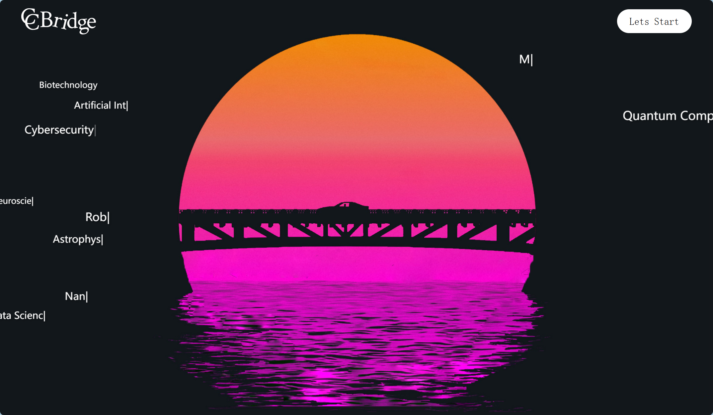
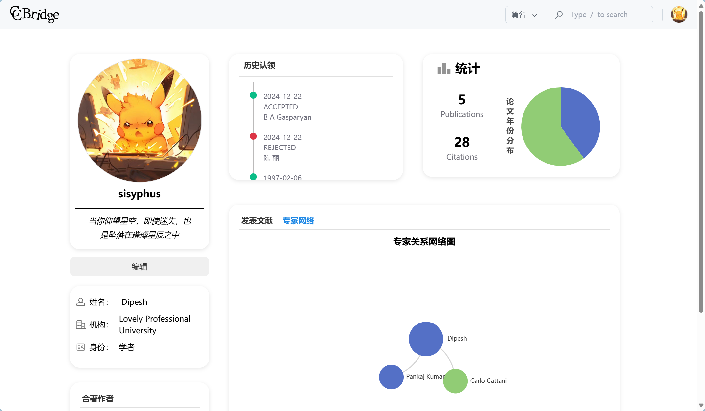
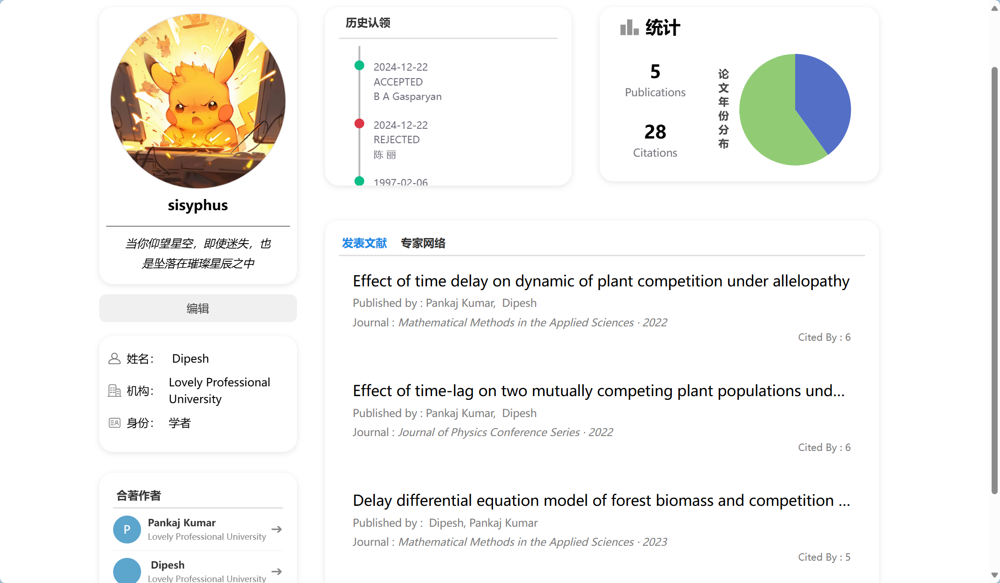
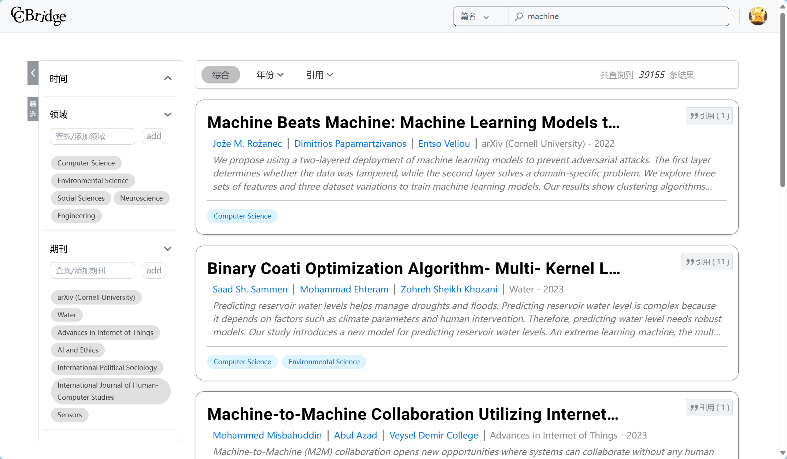
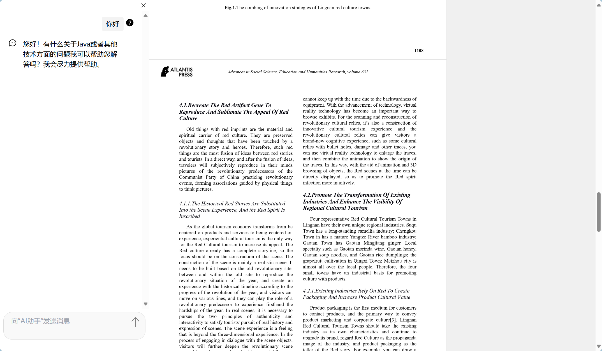

# vue3+vite
前端采用 `vue3+vite`框架
## 前置条件
需要安装`vue3` 和 `nodejs`
## 代码运行
命令行运行 `npm install`安装依赖

运行 `npm run dev`或者 `npm run serve`以运行前端代码。前者优化和启动速度快，适用于频繁改代码的开发场景（gpt说的）

## 项目展示
项目部分页面展示如下：

### 欢迎页面

### 首页

### 用户页面

### 搜索页面

### 论文详情页面

### 阅读页面

